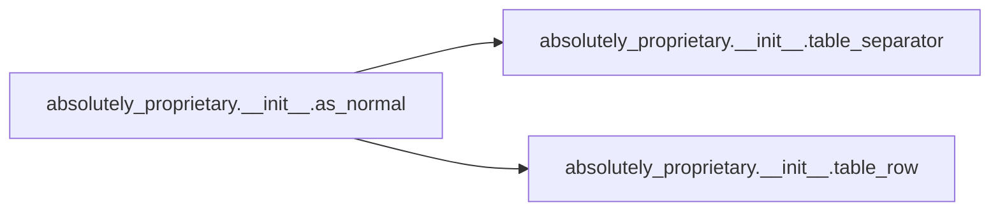

# Absolutely Proprietary

[_Documentation generated by Documatic_](https://www.documatic.com)

<!---Documatic-section-Codebase Structure-start--->
## Codebase Structure

<!---Documatic-block-system_architecture-start--->
```mermaid
None
```
<!---Documatic-block-system_architecture-end--->

# #
<!---Documatic-section-Codebase Structure-end--->

<!---Documatic-section-absolutely_proprietary.__init__.table_separator-start--->
## absolutely_proprietary.__init__.table_separator

<!---Documatic-section-table_separator-start--->
<!---Documatic-block-absolutely_proprietary.__init__.table_separator-start--->
<details>
	<summary><code>absolutely_proprietary.__init__.table_separator</code> code snippet</summary>

```python
def table_separator(w, x, y, z):
    return '+-{:<{}}-+-{:<{}}-+-{:<{}}-+-{:<{}}-+\n'.format('-' * w, w, '-' * x, x, '-' * y, y, '-' * z, z)
```
</details>
<!---Documatic-block-absolutely_proprietary.__init__.table_separator-end--->
<!---Documatic-section-table_separator-end--->

# #
<!---Documatic-section-absolutely_proprietary.__init__.table_separator-end--->

<!---Documatic-section-absolutely_proprietary.__init__.table_row-start--->
## absolutely_proprietary.__init__.table_row

<!---Documatic-section-table_row-start--->
<!---Documatic-block-absolutely_proprietary.__init__.table_row-start--->
<details>
	<summary><code>absolutely_proprietary.__init__.table_row</code> code snippet</summary>

```python
def table_row(i1, l1, i2, l2, i3, l3, i4, l4):
    return '| {:<{}} | {:<{}} | {:<{}} | {:<{}} |\n'.format(i1, l1, i2, l2, i3, l3, i4, l4)
```
</details>
<!---Documatic-block-absolutely_proprietary.__init__.table_row-end--->
<!---Documatic-section-table_row-end--->

# #
<!---Documatic-section-absolutely_proprietary.__init__.table_row-end--->

<!---Documatic-section-absolutely_proprietary.__init__.as_normal-start--->
## absolutely_proprietary.__init__.as_normal

<!---Documatic-section-as_normal-start--->


### Object Calls

* absolutely_proprietary.__init__.table_separator
* absolutely_proprietary.__init__.table_row

<!---Documatic-block-absolutely_proprietary.__init__.as_normal-start--->
<details>
	<summary><code>absolutely_proprietary.__init__.as_normal</code> code snippet</summary>

```python
def as_normal(head_name, head_status, head_alternative, head_description, pac_len, stat_len, alt_len, desc_len, stl_disapproves):
    ret = table_separator(pac_len, stat_len, alt_len, desc_len)
    ret += table_row(head_name, pac_len, head_status, stat_len, head_alternative, alt_len, head_description, desc_len)
    ret += table_separator(pac_len, stat_len, alt_len, desc_len)
    for item in stl_disapproves:
        first = True
        if len(item[2]) > 0:
            for s in item[2]:
                if first:
                    ret += table_row(item[0], pac_len, item[1], stat_len, s, alt_len, item[3], desc_len)
                    first = False
                else:
                    ret += table_row('', pac_len, '', stat_len, s, alt_len, '', desc_len)
        else:
            ret += table_row(item[0], pac_len, item[1], stat_len, '', alt_len, item[3], desc_len)
        ret += table_separator(pac_len, stat_len, alt_len, desc_len)
    return ret
```
</details>
<!---Documatic-block-absolutely_proprietary.__init__.as_normal-end--->
<!---Documatic-section-as_normal-end--->

# #
<!---Documatic-section-absolutely_proprietary.__init__.as_normal-end--->

<!---Documatic-section-absolutely_proprietary.__init__.as_markdown_header-start--->
## absolutely_proprietary.__init__.as_markdown_header

<!---Documatic-section-as_markdown_header-start--->
<!---Documatic-block-absolutely_proprietary.__init__.as_markdown_header-start--->
<details>
	<summary><code>absolutely_proprietary.__init__.as_markdown_header</code> code snippet</summary>

```python
def as_markdown_header(h1, h2, h3, h4):
    return '|{}|{}|{}|{}|  \n|---|---|---|---|  \n'.format(h1, h2, h3, h4)
```
</details>
<!---Documatic-block-absolutely_proprietary.__init__.as_markdown_header-end--->
<!---Documatic-section-as_markdown_header-end--->

# #
<!---Documatic-section-absolutely_proprietary.__init__.as_markdown_header-end--->

<!---Documatic-section-absolutely_proprietary.__init__.as_markdown_body-start--->
## absolutely_proprietary.__init__.as_markdown_body

<!---Documatic-section-as_markdown_body-start--->
<!---Documatic-block-absolutely_proprietary.__init__.as_markdown_body-start--->
<details>
	<summary><code>absolutely_proprietary.__init__.as_markdown_body</code> code snippet</summary>

```python
def as_markdown_body(w, x, y, z):
    return '|{}|{}|{}|{}|  \n'.format(w, x, y, z)
```
</details>
<!---Documatic-block-absolutely_proprietary.__init__.as_markdown_body-end--->
<!---Documatic-section-as_markdown_body-end--->

# #
<!---Documatic-section-absolutely_proprietary.__init__.as_markdown_body-end--->

[_Documentation generated by Documatic_](https://www.documatic.com)